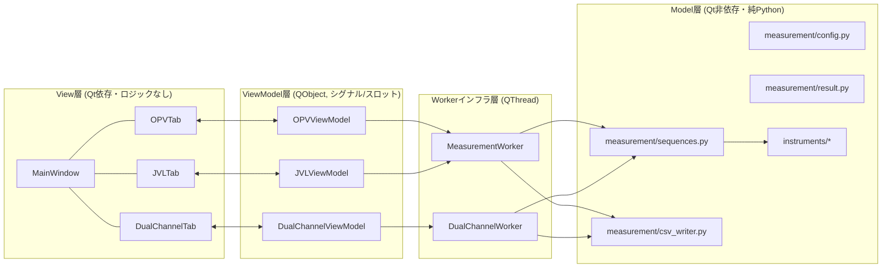
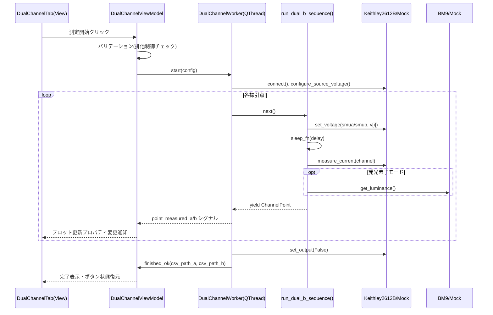

# 太陽電池と発光素子計測プログラム 要件定義書・基本設計書

作業ディレクトリ: `C:\Users\kouza.FUKU-PC\CRS\Ctrl\program_repos\Python\研究室用仮想環境\OPVJVL`

本書は同ディレクトリ配下の既存資産（`keithley2400/`, `keithley2600/`）の調査結果と、事前の要件ヒアリング（AskUserQuestionでの合意事項）を踏まえて作成した、新規開発の要件定義書（A部）と基本設計書（B部）である。実装者はこの文書のみを読んで着手できることを目標にしている。

---

# A. 要件定義書

## A-1. 目的

研究室で使用しているKeithley 2400 / Keithley 2612B（ソースメータ）とTOPCON BM9（輝度計）を用いて、太陽電池（OPV）および発光素子（LED/OLED等）のI-V特性・輝度特性を計測するGUIアプリケーションを新規開発する。既存のスクリプト群（`Keithley2400_OPV.py`, `Keithley2400_JVL.py`, `OPV_measurement_ver2.py`等）は単発実行のCUI/matplotlibベースであり、都度スクリプト改変が必要だった。これをMVVMアーキテクチャに基づくPyQtアプリケーションとして再構築し、機種選択・掃引条件設定・リアルタイムプロット・モック機器による実機なし検証を可能にする。

## A-2. 用語定義

| 用語 | 意味 |
|---|---|
| OPVモード | 太陽電池のJV特性（光照射下）を計測するモード。暗所であればIV特性（暗IV）としても利用可 |
| JVLモード | 発光素子のIV特性と輝度（BM9）を同時計測するモード。輝度計測をOFFにすれば暗IV測定としても流用可能 |
| 2ch活用モード | Keithley 2612B（2チャンネルSMU）を用いる拡張モード。モードA（低ノイズ）とモードB（2素子同時計測）を含む |
| モードA | smuaで電圧掃引・印加し、smubを0V固定の仮想接地電流計として使う低ノイズ測定（`OPV_measurement_ver2.py`踏襲） |
| モードB | smua・smubにそれぞれ別の素子を接続し、チャンネルごとに独立した掃引条件・計測種別（太陽電池/発光素子）で計測するモード |
| SMU | Source Measure Unit（ソースメータ）。Keithley 2400 / 2612B を指す |
| NPLC | Number of Power Line Cycles。積分時間の単位 |
| モック | 実機の代わりにダミー値を返すクラス群。実機なしでの開発・GUI検証に使用 |

## A-3. 対象機器と接続方式

| 機器 | 通信方式 | 既存参考実装 |
|---|---|---|
| Keithley 2400 | RS-232 シリアル（pyserial）、SCPIコマンド、9600bps 8N1 | `keithley2400/InstrumentsControl.py` |
| Keithley 2612B | USB/GPIB経由VISA（PyVISA）、TSP(Lua)コマンド | PyVISA+TSP(Lua)コマンド直送の自前実装（サードパーティ`keithley2600`パッケージ非依存。合意事項による方針） |
| TOPCON BM9（輝度計） | RS-232シリアル、2400bps, ODD parity, 7bit, stop1、コマンドは`"DBR0ST"`のみ | `keithley2400/InstrumentsControl.py`の`BM9`クラス |

Keithley 2400 と 2612B は**どちらか一方を選択**して使う（OPVモード・JVLモードで機種切替可能）。2ch活用モードはハードウェア上2612B専用（2400は1chしか持たないため選択不可＝UI上で無効化）。

## A-4. 機能要件

### A-4-1. 共通事項（全モード共通）

- 全モードで「実機／モック」をGUI上で切り替え可能とする。
- 全モードで測定開始前に接続確認（`*IDN?`等の取得）を行い、失敗時は測定を開始しない。
- 全モードで測定中はリアルタイムにpyqtgraphへプロット反映する（1点測定完了ごとに更新）。
- 全モードで「中断」ボタンにより安全に測定を停止できる（出力OFFを保証）。
- 全モードでCSV保存先ディレクトリとサンプル名を指定できる。
- 全モードでログ欄に実行ログ（接続、各点の測定値、エラー、保存パス）を表示する。

### A-4-2. OPVモード（太陽電池 JV/IV特性測定）

**目的**: 太陽電池素子の光照射下JV特性、または暗所でのIV特性を計測する（既存`Keithley2400_OPV.py`・`OPV_measurement_ver2.py`相当）。

**入力パラメータ**

| パラメータ | 型 | 既定値（既存コード踏襲） | 備考 |
|---|---|---|---|
| 機器選択 | enum | Keithley2400 | Keithley2400 / Keithley2612B(単チャンネル運用) |
| 接続先 | str | COM5 / VISAリソース文字列 | 機種選択に応じてUI切替 |
| Vmin, Vmax, Vstep | float | -0.1, 1.1, 0.02 | 電圧掃引条件 |
| 繰り返し回数 (iteration) | int | 3 | 各電圧での過渡電流モニター用の同一電圧繰り返し測定回数 |
| コンプライアンス電流 | float | 0.02 A | `configure_source_voltage`の`compliance_current` |
| 積分時間 (NPLC) | float | 1.0 | |
| 遅延時間 (delay_time) | float | 1 s | 電圧設定後、測定までの待機 |
| サンプル名 | str | ユーザー入力 | ファイル名に使用 |
| 保存先ディレクトリ | str | ユーザー選択 | |

**処理フロー**

1. 機器へ接続、`reset()` → `clear_status()` → `configure_source_voltage()`
2. 電圧リストを生成（`Vmin`〜`Vmax`を`Vstep`刻み、各点を`iteration`回繰り返し）
3. `output_on()`
4. 電圧リストを順に`set_voltage()` → `delay_time`待機 → `measure_current()`
5. 1点ごとに結果をシグナルで通知しプロット更新
6. 全点完了または中断要求で`output_off()` → `close()`
7. CSV保存

**出力データ**: `voltage [V]`, `current [A]` の2列CSV（既存フォーマット踏襲）。

### A-4-3. JVLモード（発光素子 IV-輝度測定 / 暗IV測定共通）

**目的**: 発光素子のIV特性と輝度を同時計測する。合意事項により、太陽電池の暗IV測定もこのモードを流用する（輝度計測チェックボックスをOFFにして実行すればOPVモードのIV測定と機能的に同一になる）。

**入力パラメータ**: OPVモードと同一項目に加え、

| パラメータ | 型 | 既定値 | 備考 |
|---|---|---|---|
| 輝度計測を使用する | bool | True | OFFで暗IV測定用途になる |
| BM9接続ポート | str | COM4 | 輝度計測ON時のみ入力必須 |

Vmin/Vmax/Vstepの既定値は`Keithley2400_JVL.py`踏襲で `-1.0, 1.9, 0.1`。

**処理フロー**: OPVモードと同様だが、各点の`measure_current()`直後に輝度ON時のみ`BM9.get_luminance() * 100`（既存コードの単位換算を踏襲）を取得する。

**出力データ**: 輝度計測ONなら `voltage [V]`, `current [A]`, `luminance [cd/m2]` の3列。OFFなら`voltage [V]`, `current [A]`の2列（OPVモードと同一フォーマット＝暗IVデータとしてそのまま扱える）。

### A-4-4. 2ch活用モード

このタブはKeithley 2612B選択時のみ有効。モードA/モードBをタブ内のコンボボックスで切替える。

#### A-4-4-1. モードA（2ch低ノイズ計測）

**目的**: `OPV_measurement_ver2.py`の方式踏襲。smuaで電圧を掃引・印加し、smubを0V固定の仮想接地電流計として使用、smubの測定電流のみを採用する（2chの単純平均ではない）。

**入力パラメータ**: OPVモード/JVLモードと同一項目一式に加え、

| パラメータ | 型 | 既定値 | 備考 |
|---|---|---|---|
| 計測対象モード | enum | 太陽電池 / 発光素子 | 太陽電池なら輝度計測グループを非表示・発光素子なら表示 |

**処理フロー（1点あたり）**:
```
smua.set_voltage(v)
smub.set_voltage(0.0)
sleep(delay_time)
current = -1.0 * smub.measure_current()   # 符号反転は既存コード踏襲
if 計測対象モード == 発光素子 and 輝度計測ON:
    luminance = BM9.get_luminance()
```

**出力データ**: OPVモード/JVLモードと同一の列構成（計測対象モードに応じ2列 or 3列）。ファイル名に`_dualA_`を付与して区別する。

#### A-4-4-2. モードB（2素子同時計測）— 詳細仕様

**目的**: smua・smubにそれぞれ別の素子（太陽電池 or 発光素子）を接続し、チャンネル独立の掃引条件で計測する。

**真の並列実行が必要か、逐次でよいかの検討と結論**

Keithley 2612Bは1本のVISA/USB通信リンク（単一の`pyvisa.Resource`）を介してTSPコマンドを送受信する単一の測定器である。ファームウェア自体もコマンドキューを1つしか持たないため、2つのソフトウェアスレッドから同時に同一VISAセッションへ書き込むことは、

- PyVISAの`MessageBasedResource`はスレッドセーフではなく、2スレッドから同時write/readすると応答の取り違え（クロストーク）が発生しうる。
- これを防ぐには結局ミューテックス（排他ロック）で全I/Oを直列化する必要があり、「並列化」の効果が実質失われる。
- 一方、2612Bのハードウェア自体は両チャンネルとも常時・独立にバイアスを保持し続ける（コマンドが来ていない間も出力電圧は維持される）ため、ソフトウェア側は「チャンネルAに電圧を設定 → チャンネルBに電圧を設定 → 少し待って両方測定」という**単一スレッド内での交互（ロックステップ）制御**でも、実効的には両素子がほぼ同時刻（数十ms差）でバイアスされる。

**結論**: 真のマルチスレッド並列実行は不要と判断し、**単一のQThread内でチャンネルA・チャンネルBを1ループ内で交互制御する「疑似同時（ロックステップ）方式」を採用する**。これにより、

- VISA/シリアル資源の排他制御が不要になり実装・デバッグが単純化する
- 2つの素子への印加タイミングのズレが最小化される（真の同時ではないが実用上十分）
- 中断（Stop）・エラー処理・進捗表示・ログ出力が1系統で済み、GUIとの整合が取りやすい

**GUI操作仕様**:

- モードB選択時、画面に「チャンネルA」「チャンネルB」の2つのグループが並ぶ。
- 各チャンネルは個別に「有効化チェックボックス」「計測対象モード（太陽電池/発光素子）」「Vmin/Vmax/Vstep/繰り返し回数」「積分時間/遅延時間」「サンプル名」を持つ。
- **排他制御ルール（重要）**: BM9輝度計は物理的に1台しかなく、2つの発光素子を同時に光学的にモニタすることはできない。そのため、**「発光素子モード」を同時に選択できるチャンネルは最大1つ**に制限する。GUIロジックとして、チャンネルAが「発光素子モード」を選択した場合、チャンネルBの「発光素子モード」選択肢を無効化（disable）し「太陽電池モード」のみ選択可能にする（逆も同様）。両チャンネルとも「太陽電池モード」の組み合わせは輝度計不要のため制限なし。
- 少なくとも一方のチャンネルが有効でなければ測定開始不可（バリデーションエラー表示）。
- 開始/中断ボタン、プログレスバーは共通（単一ループのため）。

**スレッド構成**: `DualChannelWorker(QThread)` 1本。内部で以下のロックステップ制御を行う。

```
Va_list = build_voltage_list(chA_config)  # チャンネルAが有効な場合のみ
Vb_list = build_voltage_list(chB_config)  # チャンネルBが有効な場合のみ
n = max(len(Va_list) if chA.enabled else 0,
        len(Vb_list) if chB.enabled else 0)

smua.output_on() if chA.enabled
smub.output_on() if chB.enabled

for i in range(n):
    if abort_requested: break

    if chA.enabled:
        if i < len(Va_list):
            smua.set_voltage(Va_list[i])
        else:
            smua.set_voltage(hold_value_a)  # 既定: 最終値保持 or 0V（設定可能）

    if chB.enabled:
        if i < len(Vb_list):
            smub.set_voltage(Vb_list[i])
        else:
            smub.set_voltage(hold_value_b)

    sleep(max(chA.delay_time, chB.delay_time))  # 共通の1回のsleepで両者を待つ

    if chA.enabled and i < len(Va_list):
        i_a = smua.measure_current()
        l_a = BM9.get_luminance() if chA.mode == "発光素子" else None
        emit point_measured_a(...)

    if chB.enabled and i < len(Vb_list):
        i_b = smub.measure_current()
        l_b = BM9.get_luminance() if chB.mode == "発光素子" else None
        emit point_measured_b(...)

smua.output_off(); smub.output_off()
```

チャンネルの掃引点数が異なる場合は、点数が少ないチャンネルは残りのループを「最終値保持」または「0V」で待機させる（設定可能、既定は最終値保持）。長さが尽きたチャンネルはその回の測定・emitをスキップする（無駄なデータ点を記録しない）。

**データ保存（ファイル分割方針）**: チャンネルA・チャンネルBは**別々のCSVファイルに保存**することを基本方針とする。理由は、掃引点数・計測項目（2列 or 3列）がチャンネルごとに異なりうるため、1ファイルに結合すると欠損値(NaN)処理が煩雑になり、既存の解析スクリプト（列名`voltage [V]`, `current [A]`前提）との互換性も損なわれるため。

```
{sample_name}_dualB_chA_{OPV|JVL}_measurement_data.csv
{sample_name}_dualB_chB_{OPV|JVL}_measurement_data.csv
```

列構成はOPVモード/JVLモードと同一（`voltage [V]`, `current [A]`, [`luminance [cd/m2]`]）。加えて、掃引条件の再現性確保のためサイドカーJSON（`{sample_name}_dualB_meta.json`）にVmin/Vmax/Vstep/NPLC/delay/機種IDN/実行日時を記録する（CSVをコメント行で汚さず、外部解析ツール等でのCSV読み込み互換性を保つため）。

## A-5. 非機能要件

### A-5-1. PyQt5/PyQt6両対応

- 本番環境: Python 3.9 + PyQt5 のみ。開発環境: Python 3.13 + PyQt6。
- 独自の互換レイヤーモジュール `qtcompat.py` を新設し、全てのGUIコードはPyQt5/PyQt6を直接importせず必ず`qtcompat`経由でimportする（詳細はB-4節）。
- サードパーティの`qtpy`パッケージ導入も選択肢として検討したが、以下の理由から**自前の軽量`qtcompat.py`を採用**する。
  - 本番環境PC（研究室）がオフライン/追加パッケージインストール制限がある可能性があり、依存を最小限にしたい。
  - ユーザーの学習目的（Qt Designer/PyQt学習）に合致し、差異を明示的にコードで理解できる。
  - 必要な差異吸収範囲が限定的（import元、`exec()/exec_()`、一部Enumのスコープ変更）であり、自作コストが小さい。

### A-5-2. Python 3.9/3.13両対応の注意点

| 項目 | 注意点 |
|---|---|
| 型ヒント | `list[str]`等のPEP585組み込みジェネリクスは3.9から利用可。`X \| Y`（PEP604 Union演算子）は3.10未満では実行時未対応のため、**全モジュール先頭に`from __future__ import annotations`を必須**とし、アノテーション文字列化で回避する |
| `match`/`case` | Python 3.10以降の機能のため**使用禁止**。`if/elif`で代替する |
| `tomllib` | 3.11以降標準。使わない（設定はJSON/ini/dataclassで代替） |
| dataclass | `field(default_factory=...)`等は3.9で問題なく利用可 |
| 依存パッケージ | numpy/pandas/pyserial/pyvisaは、3.9対応バージョンと3.13対応バージョンでピン留めを分ける（`requirements-pyqt5.txt`と`requirements-pyqt6.txt`を分離） |
| テスト | tox/nox等で `py39-pyqt5` と `py313-pyqt6` の2環境を明示的にCI/ローカルで検証する（本プロジェクトはCIサーバがない前提のため、最低限ローカルで両環境の仮想環境を用意し実行することを開発フローに明記する） |

### A-5-3. PEP8準拠

- 全モジュールに対し`flake8`または`ruff`によるLintを開発時に実行する（導入自体は必須要件ではないが、命名規則・行長・importの並びはPEP8に従う）。
- クラス名はCapWords（`Keithley2612B`等既存踏襲）、関数/変数はsnake_case、定数はUPPER_SNAKE_CASE。
- Qt Widget変数名は`objectName`と一致させ、Pythonの命名規則（snake_case）と衝突しないよう、objectNameはcamelCase（Qt Designerの慣習）、Python属性アクセスはそのままuic.loadUi後の`self.objectName`属性として扱う（既存踏襲でこのプロジェクトはPython変数として直接camelCase属性を触ることになるため、その旨をコードコメントに明記し例外的運用とする）。

### A-5-4. MVVMアーキテクチャの遵守

- View（`.ui`ロード＋薄いPythonラッパ）はロジックを持たず、ViewModelのシグナル購読とスロット呼び出しのみを行う。
- ViewModelはQt依存（`QObject`, `pyqtSignal`）を持つが、機器制御ロジックやCSV書式などの業務ロジックは一切持たず、Model層（`measurement/`, `instruments/`）に委譲する。
- Model層はQt非依存の純Python（`QObject`を継承しない）とし、pytestで単体テスト可能な形にする。
- 詳細な責務分担はB-1節を参照。

### A-5-5. 開発環境構築（仮想環境）（2026-07-10追加）

- **グローバル環境へのpip installは禁止**。開発機（Python 3.13）・本番機（Python 3.9）とも、必ずプロジェクト直下に仮想環境（venv）を作成し、その中に依存パッケージをインストールする。
- 開発機（このプロジェクトを検証する環境: Python 3.13 + PyQt6）用の仮想環境:
  ```powershell
  # プロジェクトルート(OPVJVL)で実行
  python -m venv .venv313
  .venv313\Scripts\python.exe -m pip install --upgrade pip
  .venv313\Scripts\python.exe -m pip install -r requirements-pyqt6.txt -r requirements-dev.txt
  ```
- 本番機（研究室PC: Python 3.9 + PyQt5）用の仮想環境（本番機上で別途実行する。開発機では作成不要）:
  ```powershell
  python -m venv .venv39
  .venv39\Scripts\python.exe -m pip install --upgrade pip
  .venv39\Scripts\python.exe -m pip install -r requirements-pyqt5.txt
  ```
- 以降、本プロジェクトでのPythonコマンド実行・テスト実行・アプリ起動は、すべて`.venv313\Scripts\python.exe`（開発機）を明示的に使う。グローバルの`python`コマンドを直接使わない。
- `.venv313/`, `.venv39/`はGit管理対象外とする（`.gitignore`に追加）。
- サブエージェントによる自動実装時も、依存パッケージのインストール・スクリプト実行は必ずこの仮想環境内で行う（B-8節参照）。

## A-6. モッククラスの要件

対象: `Keithley2400Mock`, `Keithley2612BMock`, `BM9Mock`（いずれも`instruments/mock/`配下）。

- 実クラスと**共通の抽象基底クラス**（`AbstractSourceMeter`, `AbstractLuminanceMeter`）を継承させ、ABC（`abc.ABC`）の抽象メソッド強制により、メソッド欠落はクラス定義時点（インスタンス化時）に`TypeError`として検出される。これによりインタフェース同一性を構造的に担保する。
- 加えて、実クラスとモッククラスの**メソッドシグネチャの一致**を検証する専用テスト（`tests/test_models/test_interface_parity.py`）を用意し、`inspect.signature()`で抽象基底クラスの各メソッドと実装クラス（実機・モック双方）のシグネチャを比較し、乖離があれば即座にテスト失敗させる。
- ダミー値生成ロジックの方針:
  - `Keithley2400Mock` / `Keithley2612BMock`: ダイオード方程式 `I = I0 * (exp(V / (n*Vt)) - 1) - I_L` に基づく擬似IV特性を生成し、`numpy.random.default_rng(seed)`によるガウスノイズを付加する。コンストラクタ引数`I0`, `n`, `I_L`（光電流オフセット、OPV用）, `noise_std`, `seed`で特性を調整可能にし、OPV用（`I_L>0`）とJVL用（`I_L=0`、整流特性のみ）のプリセットを用意する。
  - `measure_voltage()`は直前に`set_voltage()`された値＋微小ノイズを返す。
  - コンプライアンス電流を超える指令には、実機同様に電流を頭打ちにするクリッピング処理を入れる。
  - `BM9Mock`: 既定では直近の`current`値から`L = k * max(I, 0)`程度の単調な擬似輝度を返す簡易モデルを持つが、GUI結合テストで厳密な期待値検証をしたい場合のためにコンストラクタで`luminance_fn: Callable[[], float]`を注入できるようにする。
  - 全モックに**故障注入**用のオプション（`simulate_connect_failure: bool`, `fail_after_n_points: int | None`）を設け、`InstrumentError`を意図的なタイミングで送出できるようにし、エラーハンドリング経路のテストを可能にする。
  - 実際の待機時間（`time.sleep`）はモック自体には持たせず、後述（B-5節）のとおり測定シーケンス関数に`sleep_fn`を注入可能にすることでテスト高速化を図る（モック機器自体は`serial`/`pyvisa`をimportしないため、それらのパッケージが未インストールの環境でもテスト実行可能）。

## A-7. テスト戦略

### A-7-1. pytest構成案

```
tests/
  conftest.py                     # QApplication/offscreen設定、共通フィクスチャ
  test_models/
    test_interface_parity.py      # 実機/モックのシグネチャ一致検証
    test_keithley2400_mock.py
    test_keithley2612b_mock.py
    test_bm9_mock.py
    test_sequences_opv.py         # run_opv_sequence()の純粋ロジックテスト
    test_sequences_jvl.py
    test_sequences_dual_mode_a.py
    test_sequences_dual_mode_b.py
    test_csv_writer.py
  test_viewmodels/
    test_opv_viewmodel.py
    test_jvl_viewmodel.py
    test_dual_channel_viewmodel.py   # モードB排他制御バリデーションを重点的に検証
  test_views/
    test_main_window_launch.py       # 3タブが生成されること
    test_tab_switching.py
  test_integration/
    test_end_to_end_mock_measurement.py  # モックでOPV/JVL/モードA/モードB一連実行
```

### A-7-2. GUIのオフスクリーンテスト方法

- `pytest-qt`を導入し、`qtbot`フィクスチャでウィジェット生成・シグナル待ち（`qtbot.waitSignal`）・クリック操作（`qtbot.mouseClick`）を行う。
- `conftest.py`にて、`QApplication`生成前に`os.environ.setdefault("QT_QPA_PLATFORM", "offscreen")`を設定し、実ディスプレイのないCI/ターミナル環境でも実行可能にする。
- `qtcompat.QT_API`に応じて`pytest-qt`が使用するバインディングを一致させるため、`PYTEST_QT_API`環境変数を`qtcompat`の検出結果に連動させるヘルパーを`conftest.py`に用意する。

### A-7-3. モックを使った結合テストのシナリオ

1. モック機器（Keithley2400Mock/Keithley2612BMock/BM9Mock）を注入したMainWindowを起動し、3タブが存在し初期状態で開始ボタンが有効・停止ボタンが無効であることを確認する。
2. OPVタブで小さな掃引点数（例: Vmin=-0.1, Vmax=0.1, Vstep=0.05）を設定し「測定開始」をクリック、`worker.finished_ok`シグナルを`qtbot.waitSignal`で待ち、プロットの点数が期待点数と一致すること、CSVが指定ディレクトリ（`tmp_path`）に生成されることを検証する。
3. JVLタブで輝度計測ON/OFF双方のケースを検証し、CSV列数が2列/3列で切り替わることを確認する。
4. モードAで低ノイズ計測を実行し、`smub`の電流のみが採用されていること（モックに与えたダイオードパラメータから期待値を計算し照合）を検証する。
5. モードBで両チャンネル発光素子モードを選択しようとした際、GUI上でチャンネルBの発光素子選択肢が無効化されること（バリデーションUI仕様）を検証する。
6. モードBで異なる掃引点数のチャンネルA/Bを設定し、少ない方のチャンネルが早期に測定を打ち切る（emitが止まる）ことを検証する。
7. `simulate_connect_failure=True`のモックを注入し、接続失敗時にエラーダイアログ相当のシグナル（`error`）が発火し、開始ボタンが再度有効化されることを検証する。
8. 測定中に「中断」ボタンを押し、`output_off()`が呼ばれた（モックの呼び出し回数記録で検証）ことと、CSVが中断時点までのデータで保存されることを確認する。

---

# B. 基本設計書

## B-1. 全体アーキテクチャ

### B-1-1. レイヤー責務



| 層 | 責務 | Qt依存 |
|---|---|---|
| View | `.ui`のロード、ウィジェットの表示/非表示・有効/無効切替、ユーザー操作のViewModelスロットへの委譲のみ。業務ロジック・機器制御コードを一切含まない | あり |
| ViewModel | Viewから見える状態（プロパティ）とコマンド（スロット）を公開。入力値バリデーション（Vmax>=Vmin、モードB排他制御等）。Worker(QThread)の生成・破棄と、そのシグナルをView向けに中継 | あり（QObject/pyqtSignal） |
| Workerインフラ | ViewModelとModelの橋渡し。QThread上でModel層の純粋関数（ジェネレータ）を呼び出し、1点ごとにpyqtSignalへ変換して発火する。Qt依存はこの層に閉じ込める | あり（QThread） |
| Model | 機器抽象化（`instruments/`）、測定アルゴリズム（`measurement/sequences.py`）、データクラス（`measurement/config.py`, `result.py`）、CSV入出力（`measurement/csv_writer.py`）。全てQt非依存の純Pythonで、pytestで直接呼び出してテスト可能 | なし |

### B-1-2. ディレクトリ構成案

```
OPVJVL/
├── plan,.md                          # 既存(要件原文)
├── README.md                         # 新規: Mermaidで構造可視化
├── pyproject.toml                    # 新規: srcレイアウトのeditable install用
├── requirements-pyqt5.txt            # 本番(Python3.9)用
├── requirements-pyqt6.txt            # 開発(Python3.13)用
├── requirements-dev.txt              # pytest, pytest-qt, ruff等
├── src/
│   └── opvjvl/
│       ├── __init__.py
│       ├── app.py                    # エントリポイント main()
│       ├── qtcompat.py               # PyQt5/6互換レイヤー
│       ├── models/
│       │   ├── __init__.py
│       │   ├── instruments/
│       │   │   ├── __init__.py
│       │   │   ├── base.py           # AbstractSourceMeter, AbstractLuminanceMeter, InstrumentError
│       │   │   ├── keithley2400.py
│       │   │   ├── keithley2612b.py
│       │   │   ├── bm9.py
│       │   │   ├── registry.py       # ファクトリ(機種/モック切替)
│       │   │   └── mock/
│       │   │       ├── __init__.py
│       │   │       ├── keithley2400_mock.py
│       │   │       ├── keithley2612b_mock.py
│       │   │       └── bm9_mock.py
│       │   └── measurement/
│       │       ├── __init__.py
│       │       ├── config.py         # OPVConfig, JVLConfig, DualAConfig, DualBConfig, ChannelConfig
│       │       ├── result.py         # IVPoint, IVLPoint, ChannelPoint, MeasurementResult
│       │       ├── sequences.py      # run_opv_sequence, run_jvl_sequence, run_dual_a_sequence, run_dual_b_sequence
│       │       └── csv_writer.py
│       ├── workers/
│       │   ├── __init__.py
│       │   ├── measurement_worker.py     # OPV/JVL/モードA共通ワーカー
│       │   └── dual_channel_worker.py    # モードB専用ワーカー
│       ├── viewmodels/
│       │   ├── __init__.py
│       │   ├── base_viewmodel.py
│       │   ├── opv_viewmodel.py
│       │   ├── jvl_viewmodel.py
│       │   ├── dual_channel_viewmodel.py
│       │   └── device_discovery.py       # COMポート/VISAリソース列挙
│       ├── views/
│       │   ├── __init__.py
│       │   ├── main_window.py
│       │   ├── opv_tab.py
│       │   ├── jvl_tab.py
│       │   ├── dual_channel_tab.py
│       │   ├── theme.py                  # QSSダークテーマ定義
│       │   └── widgets/
│       │       └── __init__.py
│       ├── resources/
│       │   ├── ui/
│       │   │   ├── main_window.ui
│       │   │   ├── opv_tab.ui
│       │   │   ├── jvl_tab.ui
│       │   │   └── dual_channel_tab.ui
│       │   └── icons/
│       └── utils/
│           ├── __init__.py
│           └── logging_utils.py
├── tests/
│   ├── conftest.py
│   ├── test_models/…
│   ├── test_viewmodels/…
│   ├── test_views/…
│   └── test_integration/…
├── keithley2400/                     # 既存(参照用に残す。変更しない)
└── keithley2600/                     # 既存(参照用に残す)
```

新規プロジェクトは`src/opvjvl/`配下に構築し、既存の`keithley2400/`, `keithley2600/`は改変せず参照専用として残す（合意事項3）。

## B-2. 機種抽象化設計

### B-2-1. `AbstractSourceMeter`（`src/opvjvl/models/instruments/base.py`）

```python
from __future__ import annotations
from abc import ABC, abstractmethod

class InstrumentError(Exception):
    """測定器関連の例外の基底クラス。"""

class AbstractSourceMeter(ABC):
    """Keithley 2400 / 2612B を機種非依存に扱うための共通インタフェース。

    Keithley2400は物理的に1チャンネルしか持たないため、channel引数には
    常に"default"を渡す(あるいは省略時デフォルト値として扱う)。
    Keithley2612Bはchannelに"smua"または"smub"を渡す。
    """

    #: このインスタンスが公開するチャンネル名の一覧
    channels: tuple[str, ...]

    @abstractmethod
    def connect(self) -> str:
        """機器に接続し、*IDN?相当の識別文字列を返す。失敗時はInstrumentError。"""

    @abstractmethod
    def close(self) -> None: ...

    @abstractmethod
    def reset(self) -> None: ...

    @abstractmethod
    def configure_source_voltage(
        self, channel: str, compliance_current: float, nplc: float,
        auto_range: bool = True,
    ) -> None: ...

    @abstractmethod
    def set_output(self, channel: str, on: bool) -> None: ...

    @abstractmethod
    def set_voltage(self, channel: str, voltage: float) -> None: ...

    @abstractmethod
    def measure_current(self, channel: str) -> float: ...

    @abstractmethod
    def measure_voltage(self, channel: str) -> float: ...

    def __enter__(self) -> "AbstractSourceMeter":
        self.connect()
        return self

    def __exit__(self, exc_type, exc_val, exc_tb) -> None:
        self.close()
```

`Keithley2400`実装は`channels = ("default",)`とし、`channel`引数は受け取るが内部では無視する（既存`InstrumentsControl.py`のSCPIコマンドをそのまま利用）。`Keithley2612B`実装は`channels = ("smua", "smub")`とし、PyVISA+TSPコマンド直送で制御する（`_validate_channel`によるチャンネルバリデーションを備える）。

### B-2-2. `AbstractLuminanceMeter`（BM9用）

```python
class AbstractLuminanceMeter(ABC):
    @abstractmethod
    def connect(self) -> None: ...
    @abstractmethod
    def close(self) -> None: ...
    @abstractmethod
    def get_luminance(self) -> float: ...

    def __enter__(self) -> "AbstractLuminanceMeter":
        self.connect()
        return self
    def __exit__(self, exc_type, exc_val, exc_tb) -> None:
        self.close()
```

`BM9`実装は`bases/keithley2400/InstrumentsControl.py`の`BM9`クラスのロジック（2400bps, ODD parity, 7bit, stop1, `"DBR0ST"`コマンド）をそのまま移植する。

### B-2-3. ファクトリ（`registry.py`）

```python
def create_source_meter(
    device_type: Literal["keithley2400", "keithley2612b"],
    connection: str,
    use_mock: bool = False,
    **kwargs,
) -> AbstractSourceMeter: ...

def create_luminance_meter(connection: str, use_mock: bool = False, **kwargs) -> AbstractLuminanceMeter: ...
```

ViewModelはこのファクトリのみを呼び出し、実クラス/モッククラスを意識しない。

## B-3. PyQt5/PyQt6互換レイヤーの具体設計（`qtcompat.py`）

```python
"""qtcompat.py
PyQt5 / PyQt6 の差異を吸収する薄い互換レイヤー。
アプリケーション内の全モジュールはPyQt5/PyQt6を直接importせず、
必ず `from opvjvl import qtcompat` あるいは
`from opvjvl.qtcompat import QtCore, QtGui, QtWidgets, ...` を使うこと。

このモジュールは他の全モジュールより先にimportされ、
pyqtgraphが使用するQtバインディングを一致させるために
PYQTGRAPH_QT_LIB 環境変数をここで確定させる。
"""
from __future__ import annotations
import enum
import os

try:
    from PyQt6 import QtCore, QtGui, QtWidgets, uic
    from PyQt6.QtCore import pyqtSignal, pyqtSlot, Qt, QThread, QObject
    from PyQt6.QtWidgets import QApplication
    from PyQt6.QtGui import QAction          # PyQt6ではQActionはQtGuiに移動
    QT_API = "PyQt6"
except ImportError:
    from PyQt5 import QtCore, QtGui, QtWidgets, uic
    from PyQt5.QtCore import pyqtSignal, pyqtSlot, Qt, QThread, QObject
    from PyQt5.QtWidgets import QApplication, QAction  # PyQt5ではQtWidgetsにある
    QT_API = "PyQt5"

# pyqtgraphが起動時に検出するQtバインディングを、上で確定させたものと一致させる。
# これを怠ると、両方インストールされた環境でpyqtgraphが別バインディングを
# 掴んでQApplicationの二重生成/クラッシュを引き起こす可能性がある。
os.environ.setdefault("PYQTGRAPH_QT_LIB", QT_API)


def qt_exec(app_or_dialog):
    """PyQt5の exec_() と PyQt6の exec() の差異を吸収する。"""
    fn = getattr(app_or_dialog, "exec", None) or getattr(app_or_dialog, "exec_")
    return fn()


def enum_value(container, name: str):
    """PyQt5(フラットEnum: Qt.AlignCenter)とPyQt6(スコープドEnum:
    Qt.AlignmentFlag.AlignCenter)の差異を吸収して定数を取得する。

    使用例: enum_value(Qt, "AlignCenter")
    """
    if hasattr(container, name):
        return getattr(container, name)
    for attr_name in dir(container):
        attr = getattr(container, attr_name)
        if isinstance(attr, type) and issubclass(attr, enum.Enum) and hasattr(attr, name):
            return getattr(attr, name)
    raise AttributeError(f"{container!r} に列挙値 {name!r} が見つかりません")
```

- **import分岐の書き方**: 上記のように`try: PyQt6 / except ImportError: PyQt5`とし、開発機（3.13/PyQt6）を優先的に試す。本番機（3.9）にはPyQt6を入れない前提のため、自然にPyQt5側にフォールバックする。
- **`.ui`ロード**: `uic.loadUi`のAPIはPyQt5/PyQt6で同一シグネチャのため、`qtcompat.uic.loadUi(path, self)`の形でView側から共通に呼べる。
- **pyqtgraphとの整合性**: pyqtgraph 0.13以降は`pyqtgraph.Qt`が自動的にインストール済みバインディングを検出するが、両バインディングが混在しうる開発環境では`PYQTGRAPH_QT_LIB`環境変数で明示指定しないと不整合が起きうるため、`qtcompat.py`の末尾で必ず設定する。**アプリのどのモジュールよりも先に`qtcompat`をimportすること**を規約とする（`app.py`の最上部でimportする）。
- **Enum差異**: `Qt.AlignmentFlag.AlignCenter`（PyQt6）と`Qt.AlignCenter`（PyQt5）のような差異は、頻出するもの（`Qt.AlignCenter`, `QHeaderView.ResizeMode.Stretch`, `QMessageBox.StandardButton.Yes`等）に限り`enum_value()`ヘルパーで解決する。View側コードでは`qtcompat.enum_value(Qt, "AlignCenter")`のように利用する。
- 代替案として`qtpy`パッケージ導入も検討したが、A-5-1節の理由により自作`qtcompat.py`を採用する（依存最小化・学習目的合致）。

## B-4. 測定シーケンス設計（擬似コード）

`measurement/sequences.py`はQt非依存のジェネレータ関数として実装し、Workerがそれをラップしてシグナル化する。`sleep_fn`を注入可能にすることでテスト時に実待機をスキップできる。

### B-4-1. OPVシーケンス

```python
def run_opv_sequence(
    smu: AbstractSourceMeter, config: OPVConfig,
    is_aborted: Callable[[], bool],
    sleep_fn: Callable[[float], None] = time.sleep,
) -> Iterator[IVPoint]:
    smu.reset()
    smu.configure_source_voltage("default", config.compliance_current, config.nplc)
    voltage_list = config.build_voltage_list()
    smu.set_output("default", True)
    try:
        for i, v in enumerate(voltage_list):
            if is_aborted():
                break
            smu.set_voltage("default", v)
            sleep_fn(config.delay_time)
            current = smu.measure_current("default")
            yield IVPoint(index=i, voltage=v, current=current)
    finally:
        smu.set_output("default", False)
```

### B-4-2. JVLシーケンス

`run_opv_sequence`とほぼ同じだが、`luminance_meter`が渡され、`config.use_luminance`がTrueの時のみ`IVLPoint`を生成する。暗IV測定は`config.use_luminance=False`で呼び出すことで実現する（新規実装不要という要件通り、内部的にはOPVシーケンスと共通化してもよいが、UI/ViewModelとしてはJVLタブから呼ぶ運用とする）。

### B-4-3. モードAシーケンス

```python
def run_dual_a_sequence(
    smu: AbstractSourceMeter, config: DualAConfig,
    is_aborted, sleep_fn=time.sleep, luminance_meter: AbstractLuminanceMeter | None = None,
) -> Iterator[IVPoint | IVLPoint]:
    smu.configure_source_voltage("smua", config.compliance_current, config.nplc)
    voltage_list = config.build_voltage_list()
    smu.set_output("smua", True)
    smu.set_output("smub", True)
    try:
        for i, v in enumerate(voltage_list):
            if is_aborted():
                break
            smu.set_voltage("smua", v)
            smu.set_voltage("smub", 0.0)
            sleep_fn(config.delay_time)
            current = -1.0 * smu.measure_current("smub")   # 仮想接地電流計。符号反転は既存踏襲
            if config.device_mode == "発光素子" and luminance_meter is not None:
                yield IVLPoint(index=i, voltage=v, current=current,
                                luminance=luminance_meter.get_luminance())
            else:
                yield IVPoint(index=i, voltage=v, current=current)
    finally:
        smu.set_output("smua", False)
        smu.set_output("smub", False)
```

### B-4-4. モードBシーケンス（ロックステップ）

```python
def run_dual_b_sequence(
    smu: AbstractSourceMeter, config: DualBConfig,
    is_aborted, sleep_fn=time.sleep, luminance_meter: AbstractLuminanceMeter | None = None,
) -> Iterator[ChannelPoint]:
    va_list = config.channel_a.build_voltage_list() if config.channel_a.enabled else []
    vb_list = config.channel_b.build_voltage_list() if config.channel_b.enabled else []
    n = max(len(va_list), len(vb_list))

    if config.channel_a.enabled: smu.set_output("smua", True)
    if config.channel_b.enabled: smu.set_output("smub", True)

    try:
        for i in range(n):
            if is_aborted():
                break

            if config.channel_a.enabled and i < len(va_list):
                smu.set_voltage("smua", va_list[i])
            if config.channel_b.enabled and i < len(vb_list):
                smu.set_voltage("smub", vb_list[i])

            sleep_fn(max(config.channel_a.delay_time, config.channel_b.delay_time))

            if config.channel_a.enabled and i < len(va_list):
                i_a = smu.measure_current("smua")
                l_a = luminance_meter.get_luminance() if config.channel_a.device_mode == "発光素子" else None
                yield ChannelPoint(channel="A", index=i, voltage=va_list[i], current=i_a, luminance=l_a)

            if config.channel_b.enabled and i < len(vb_list):
                i_b = smu.measure_current("smub")
                l_b = luminance_meter.get_luminance() if config.channel_b.device_mode == "発光素子" else None
                yield ChannelPoint(channel="B", index=i, voltage=vb_list[i], current=i_b, luminance=l_b)
    finally:
        smu.set_output("smua", False)
        smu.set_output("smub", False)
```

Worker（`DualChannelWorker`）は`ChannelPoint.channel`を見て、View側の対応するプロット/CSVバッファへ振り分けるシグナル（`point_measured_a`, `point_measured_b`）を発火する。

### B-4-5. シーケンス図（モードB, mermaid）



## B-5. データモデル設計

### B-5-1. 値オブジェクト（`measurement/result.py`）

```python
from __future__ import annotations
from dataclasses import dataclass
from typing import Optional, Literal

@dataclass(frozen=True)
class IVPoint:
    index: int
    voltage: float
    current: float

@dataclass(frozen=True)
class IVLPoint(IVPoint):
    luminance: Optional[float] = None

@dataclass(frozen=True)
class ChannelPoint:
    channel: Literal["A", "B"]
    index: int
    voltage: float
    current: float
    luminance: Optional[float] = None
```

### B-5-2. 設定オブジェクト（`measurement/config.py`）

```python
@dataclass
class OPVConfig:
    device_type: Literal["keithley2400", "keithley2612b"]
    connection: str
    use_mock: bool = False
    v_min: float = -0.1
    v_max: float = 1.1
    v_step: float = 0.02
    iteration: int = 3
    compliance_current: float = 0.02
    nplc: float = 1.0
    delay_time: float = 1.0
    sample_name: str = "sample"
    save_dir: str = "."

    def build_voltage_list(self) -> np.ndarray:
        base = np.arange(self.v_min, self.v_max + self.v_step, self.v_step)
        return np.repeat(base, self.iteration)

@dataclass
class JVLConfig(OPVConfig):
    use_luminance: bool = True
    bm9_port: Optional[str] = None

@dataclass
class DualAConfig(OPVConfig):
    device_mode: Literal["太陽電池", "発光素子"] = "太陽電池"
    use_luminance: bool = False
    bm9_port: Optional[str] = None

@dataclass
class ChannelConfig:
    enabled: bool = True
    device_mode: Literal["太陽電池", "発光素子"] = "太陽電池"
    v_min: float = -0.1
    v_max: float = 1.1
    v_step: float = 0.02
    iteration: int = 3
    nplc: float = 1.0
    delay_time: float = 1.0
    sample_name: str = "sample"
    hold_at_end: Literal["last_value", "zero"] = "last_value"

    def build_voltage_list(self) -> np.ndarray: ...

@dataclass
class DualBConfig:
    connection: str
    use_mock: bool = False
    channel_a: ChannelConfig = field(default_factory=ChannelConfig)
    channel_b: ChannelConfig = field(default_factory=lambda: ChannelConfig(enabled=False))
    bm9_port: Optional[str] = None
    save_dir: str = "."
```

### B-5-3. CSV出力フォーマット

既存解析資産との互換性を優先し、**列名は既存踏襲**とする。

| モード | ファイル名 | 列構成 |
|---|---|---|
| OPV | `{sample_name}_OPV_measurement_data.csv` | `voltage [V]`, `current [A]` |
| JVL(輝度あり) | `{sample_name}_JVL_measurement_data.csv` | `voltage [V]`, `current [A]`, `luminance [cd/m2]` |
| JVL(暗IV, 輝度なし) | `{sample_name}_JVL_measurement_data.csv` | `voltage [V]`, `current [A]` |
| モードA | `{sample_name}_dualA_{OPV\|JVL}_measurement_data.csv` | 計測対象モードに応じ2列 or 3列 |
| モードB チャンネルA | `{sample_name}_dualB_chA_{OPV\|JVL}_measurement_data.csv` | 同上 |
| モードB チャンネルB | `{sample_name}_dualB_chB_{OPV\|JVL}_measurement_data.csv` | 同上 |
| モードB メタ情報 | `{sample_name}_dualB_meta.json` | 掃引条件・NPLC・delay・機種IDN・実行日時（サイドカー、外部解析ツール等でのCSV読み込みに影響しないようCSV本体には混在させない） |

CSVは標準の `csv` モジュール（`csv.writer` 等）を用いて出力する（依存ライブラリ肥大化防止のため、`pandas` は使用しない）。

## B-6. Qt Designerレイアウト仕様（最重要）

### B-6-1. `.ui`ファイルの構成方針（2026-07-10改訂: ハイブリッド方式）

当初は**1タブ=1`.ui`ファイル**の構成（Qt Designerで4ファイルすべてを作成）を想定していたが、開発速度を優先し以下の**ハイブリッド方式**に変更する。

- **`main_window.ui`**: ユーザーが既にQt Designerで作成済み（`src/opvjvl/resources/ui/main_window.ui`）。`QMainWindow` + 空の`mainTabWidget`(QTabWidget) + `menuBar`(menuFile→actionExit, menuHelp→actionAbout) + `statusBar`という最小構成が既にでき上がっており、これをそのまま採用する（Qt Designer学習の成果物として維持）。
- **`opv_tab.ui` / `jvl_tab.ui` / `dual_channel_tab.ui`**: 各タブは設定項目が多く`.ui`を手作業で組むと時間がかかるため、**Qt Designerでは作らず、Pythonコードで直接ウィジェットツリーを構築する**（`views/opv_tab.py`等）。ウィジェット構成・`objectName`命名規則（B-6-2節）はQt Designerで作る場合と完全に同一の仕様を保つ。これにより、
  - 将来ユーザーがQt Designerでの学習を再開したい場合、同じ`objectName`規約のまま`.ui`化して`uic.loadUi`に差し替えるだけで移行できる（Pythonコード側のロジックはオブジェクト名を介して疎結合なので影響範囲が小さい）。
  - サブエージェントによる自動実装においても、手書きの`.ui` XML（属人的でミスが起きやすい）より、Pythonコードのほうが構造をテストで検証しやすく信頼性が高い。

```
src/opvjvl/resources/ui/
└── main_window.ui         # Qt Designer作成済み。QMainWindow+空mainTabWidget+menuBar+statusBar

src/opvjvl/views/
├── main_window.py          # main_window.ui を uic.loadUi でロードし、以下3タブを mainTabWidget.addTab() で挿入
├── opv_tab.py               # QWidgetサブクラス。OPVモードの全ウィジェットをPythonで構築(B-6-2節のツリーに準拠)
├── jvl_tab.py               # 同上、JVLモード
└── dual_channel_tab.py      # 同上、2ch活用モード
```

`main_window.py`は`main_window.ui`をロードした上で、`opv_tab.py`等が提供するQWidgetインスタンスを`mainTabWidget.addTab(...)`でコード側から挿入する。

### B-6-2. オブジェクト階層とobjectName命名規則

**共通規則**: `objectName`はcamelCase。タブ固有ウィジェットには接頭辞（`opv_`, `jvl_`, `dual_`）を付与し、モードBのチャンネル固有ウィジェットにはさらに`chA_`/`chB_`を付与する。

```
MainWindow (QMainWindow, objectName="MainWindow")
└── centralWidget (QWidget)
    └── mainTabWidget (QTabWidget)
        ├── [タブ0] "OPVモード" ← opv_tab.ui をロードしたQWidgetを挿入
        ├── [タブ1] "JVLモード" ← jvl_tab.ui
        └── [タブ2] "2ch活用モード" ← dual_channel_tab.ui
    ├── menuBar (QMenuBar)
    │   ├── menuFile ("ファイル") → actionExit
    │   └── menuHelp ("ヘルプ") → actionAbout
    └── statusbar (QStatusBar, objectName="statusbar")
```

**OPVタブ（`opv_tab.ui`）階層**:

```
OPVTabForm (QWidget, トップレベル)
└── opv_rootLayout (QHBoxLayout)
    └── opv_splitter (QSplitter, orientation=Horizontal)
        ├── opv_settingsScrollArea (QScrollArea, widgetResizable=true)
        │   └── opv_settingsContainer (QWidget)
        │       └── opv_settingsLayout (QVBoxLayout)
        │           ├── opv_connectionGroupBox (QGroupBox "接続設定")
        │           │   └── opv_connectionFormLayout (QFormLayout)
        │           │       ├── "機器選択:" — opv_deviceTypeCombo (QComboBox)
        │           │       ├── "モック使用:" — opv_useMockCheckBox (QCheckBox)
        │           │       ├── "接続先(COM/VISA):" — opv_connectionCombo (QComboBox, editable)
        │           │       └── (再検索ボタン) opv_refreshDevicesButton (QPushButton) ※QHBoxLayoutで接続先と横並び
        │           ├── opv_sweepGroupBox (QGroupBox "電圧掃引条件")
        │           │   └── opv_sweepFormLayout (QFormLayout)
        │           │       ├── "Vmin:" — opv_vMinSpin (QDoubleSpinBox)
        │           │       ├── "Vmax:" — opv_vMaxSpin (QDoubleSpinBox)
        │           │       ├── "Vstep:" — opv_vStepSpin (QDoubleSpinBox)
        │           │       └── "繰り返し回数:" — opv_iterationSpin (QSpinBox)
        │           ├── opv_timingGroupBox (QGroupBox "タイミング/コンプライアンス")
        │           │   └── opv_timingFormLayout (QFormLayout)
        │           │       ├── "積分時間(NPLC):" — opv_nplcSpin (QDoubleSpinBox)
        │           │       ├── "遅延時間[s]:" — opv_delaySpin (QDoubleSpinBox)
        │           │       └── "コンプライアンス電流[A]:" — opv_complianceSpin (QDoubleSpinBox)
        │           ├── opv_saveGroupBox (QGroupBox "保存")
        │           │   └── opv_saveFormLayout (QFormLayout)
        │           │       ├── "サンプル名:" — opv_sampleNameEdit (QLineEdit)
        │           │       └── "保存先:" — [opv_saveDirEdit (QLineEdit) + opv_browseSaveDirButton (QPushButton)] (QHBoxLayout)
        │           ├── opv_runGroupBox (QGroupBox "実行")
        │           │   └── opv_runLayout (QHBoxLayout)
        │           │       ├── opv_startButton (QPushButton "測定開始")
        │           │       └── opv_stopButton (QPushButton "中断", enabled=false)
        │           └── (Vertical Spacer)
        └── opv_displayPanel (QWidget)
            └── opv_displayLayout (QVBoxLayout)
                ├── opv_progressBar (QProgressBar)
                ├── opv_plotWidget (QWidget → **promote先**: pyqtgraph.PlotWidget)
                └── opv_logGroupBox (QGroupBox "ログ")
                    └── opv_logLayout (QVBoxLayout)
                        └── opv_logTextEdit (QTextEdit, readOnly=true)
```

**JVLタブ（`jvl_tab.ui`）**: OPVタブと同一構成に加え、`opv_luminanceGroupBox`相当を追加。

```
jvl_luminanceGroupBox (QGroupBox "輝度計(BM9)")
└── jvl_luminanceLayout (QVBoxLayout)
    ├── jvl_useLuminanceCheckBox (QCheckBox "BM9で輝度も測定する(OFFで暗IV測定)")
    └── jvl_luminanceFormLayout (QFormLayout)
        └── "ポート:" — jvl_bm9PortCombo (QComboBox, editable) + jvl_refreshBm9PortsButton
```

表示パネルは`QTabWidget jvl_plotTabWidget`を挟み、2ページ構成:
- ページ0 "I-V": `jvl_ivPlotWidget` (promoted PlotWidget)
- ページ1 "I-V-L": `jvl_ivlPlotWidget` (promoted PlotWidget、右軸に輝度を重ね描画。`ViewBox`二重化パターンをコードで実装)

**2ch活用モードタブ（`dual_channel_tab.ui`）**:

```
DualChannelTabForm (QWidget)
└── dual_rootLayout (QVBoxLayout)
    ├── dual_modeSelectRow (QHBoxLayout)
    │   ├── "動作モード:" (QLabel)
    │   └── dual_modeSelectCombo (QComboBox: "モードA: 2ch低ノイズ計測" / "モードB: 2素子同時計測")
    └── dual_modeStack (QStackedWidget)
        ├── [page0] dual_modeAPage (QWidget)
        │   └── dual_a_splitter (QSplitter, Horizontal)
        │       ├── dual_a_settingsScrollArea → dual_a_settingsContainer
        │       │   ├── dual_a_connectionGroupBox ("接続設定": dual_a_useMockCheckBox, dual_a_connectionCombo)
        │       │   ├── dual_a_deviceModeGroupBox ("計測対象": dual_a_deviceModeCombo [太陽電池/発光素子])
        │       │   ├── dual_a_sweepGroupBox (dual_a_vMinSpin/vMaxSpin/vStepSpin/iterationSpin)
        │       │   ├── dual_a_timingGroupBox (dual_a_nplcSpin/delaySpin/complianceSpin)
        │       │   ├── dual_a_luminanceGroupBox (dual_a_bm9PortCombo, deviceMode=発光素子でのみenabled)
        │       │   ├── dual_a_saveGroupBox (dual_a_sampleNameEdit, dual_a_saveDirEdit+browseButton)
        │       │   └── dual_a_runGroupBox (dual_a_startButton, dual_a_stopButton)
        │       └── dual_a_displayPanel (dual_a_progressBar, dual_a_plotWidget[promoted], dual_a_logTextEdit)
        └── [page1] dual_modeBPage (QWidget)
            └── dual_b_rootLayout (QVBoxLayout)
                ├── dual_b_connectionGroupBox ("接続設定(2612B共通)": dual_b_useMockCheckBox, dual_b_connectionCombo)
                ├── dual_b_channelsSplitter (QSplitter, Horizontal)
                │   ├── dual_channelAGroupBox (QGroupBox "チャンネルA (smua)")
                │   │   └── dual_chA_formLayout (QFormLayout)
                │   │       ├── dual_chA_enableCheckBox (QCheckBox "有効")
                │   │       ├── "計測対象:" — dual_chA_deviceModeCombo (太陽電池/発光素子)
                │   │       ├── "Vmin/Vmax/Vstep:" — dual_chA_vMinSpin/vMaxSpin/vStepSpin
                │   │       ├── "繰り返し回数:" — dual_chA_iterationSpin
                │   │       ├── "NPLC/遅延:" — dual_chA_nplcSpin/delaySpin
                │   │       ├── dual_chA_luminanceGroupBox ("輝度計測(BM9共有)": dual_chA_useBm9CheckBox)
                │   │       └── "サンプル名:" — dual_chA_sampleNameEdit
                │   └── dual_channelBGroupBox (QGroupBox "チャンネルB (smub)")
                │       └── dual_chB_formLayout (同様に dual_chB_* )
                ├── dual_b_bm9GroupBox ("輝度計(BM9)ポート": dual_b_bm9PortCombo)  ※チャンネル横断で1つのみ
                ├── dual_b_saveGroupBox (dual_b_saveDirEdit + dual_b_browseSaveDirButton)
                ├── dual_b_runGroupBox (dual_b_startButton, dual_b_stopButton, dual_b_progressBar)
                └── dual_b_displayTabWidget (QTabWidget)
                    ├── [page0] "チャンネルA" — dual_chA_plotWidget (promoted PlotWidget)
                    ├── [page1] "チャンネルB" — dual_chB_plotWidget (promoted PlotWidget)
                    └── (共通) dual_b_logTextEdit (QTextEdit, readOnly) をタブ下部に配置
```

**モードB排他制御（発光素子は1チャンネルまで）のUI表現**: `.ui`ファイル自体には条件分岐は書けないため、`dual_chA_deviceModeCombo`と`dual_chB_deviceModeCombo`の`currentIndexChanged`シグナルをViewModel側の`on_channel_a_mode_changed`/`on_channel_b_mode_changed`スロットに接続し、一方が「発光素子」を選択した際にもう一方のコンボから「発光素子」項目を`removeItem`/再構築（またはQStandardItemModelの`setEnabled(False)`）する形でコード側から動的制御する。

### B-6-3. ウィジェット種類・レイアウト種別まとめ表

| 目的 | ウィジェット種類 | 配置レイアウト |
|---|---|---|
| タブ切替 | QTabWidget | QMainWindowのcentralWidget直下 |
| 左右分割(設定/表示) | QSplitter (Horizontal) | 各タブのルートQHBoxLayout内 |
| 設定パネルのスクロール対応 | QScrollArea + 内部QWidget | 左ペイン |
| 機能グルーピング | QGroupBox | QVBoxLayout内に縦積み |
| ラベル+入力の対応 | QFormLayout | 各QGroupBox内 |
| 数値入力(電圧/時間/電流) | QDoubleSpinBox | QFormLayoutの値側 |
| 整数入力(繰り返し回数) | QSpinBox | 同上 |
| 機種/モード選択 | QComboBox | 同上 |
| ON/OFF切替 | QCheckBox | QFormLayoutまたは単独行 |
| テキスト入力(サンプル名/ポート) | QLineEdit / QComboBox(editable) | 同上 |
| ディレクトリ選択 | QLineEdit + QPushButton | QHBoxLayoutで横並び |
| 開始/中断 | QPushButton (objectName末尾 `startButton`/`stopButton`でQSS適用) | QHBoxLayout |
| 進捗表示 | QProgressBar | 表示パネル上部 |
| グラフ表示 | QWidget→PlotWidgetへpromote | 表示パネル中央 |
| ログ表示 | QTextEdit (readOnly) | 表示パネル下部 |
| モードA/B切替 | QComboBox + QStackedWidget | dual_channel_tabルート |
| チャンネルA/B横並び | QSplitter (Horizontal) または QHBoxLayout | dual_modeBPage内 |

### B-6-4. `.ui`ファイルの命名・配置場所

- 配置場所: `src/opvjvl/resources/ui/`
- ファイル名: `main_window.ui`, `opv_tab.ui`, `jvl_tab.ui`, `dual_channel_tab.ui`（すべてsnake_case、拡張子`.ui`）
- 実行時ロードは`importlib.resources`または`pathlib.Path(__file__).parent / "resources/ui/xxx.ui"`でパッケージ相対パス解決する（PyInstaller等で将来配布する場合も考慮し、ハードコードの絶対パスは使わない）。

### B-6-5. Qt Designerでの配置作業手順（初心者向け・将来の移行用参考手順）

> **注記（B-6-1改訂に伴う位置づけ）**: `opv_tab.ui`等は当面Pythonコードで実装するため、以下の手順は現時点では実行しない。ユーザーが後日Qt Designerでの学習を目的に`.ui`化へ移行する場合の参考手順として残す。ウィジェット構成・`objectName`はPython実装（B-6-2節準拠）と同一にしてあるため、いつでも本手順で`.ui`へ移行可能。

1. **フォーム作成**: Qt Designer起動 → 「新規フォーム」→ タブ単体の`.ui`を作る場合は「Widget」テンプレートを選択（`QMainWindow`を選ぶのは`main_window.ui`のみ）。
2. **オブジェクト名の付け方**: 各ウィジェットを配置したら、プロパティエディタの`objectName`欄で本設計書のB-6-2節に従った名前を即座に設定する（Designerの自動採番`groupBox_2`等をそのまま残さない）。命名は「タブ接頭辞\_役割」の順（例: `opv_vMinSpin`）。
3. **レイアウト適用**: ウィジェットを複数配置したら、選択→右クリック→「レイアウト」→ 該当するもの（`Lay Out Vertically`=QVBoxLayout, `Lay Out in a Form Layout`=QFormLayout等）を適用する。レイアウト自体にも`objectName`を設定する（例: `opv_sweepFormLayout`）。
4. **QGroupBoxでのグルーピング**: 関連ウィジェット群を選択した状態で「レイアウト」→「グループボックスの中にレイアウトする」は無いため、先にQGroupBoxをパレットから配置し、その中にウィジェットをドラッグ&ドロップしてから上記3のレイアウト適用を行う。
5. **QSplitterの適用**: 左右2ペインを作る場合、2つのコンテナウィジェット（QScrollAreaとQWidget等）を選択した状態で右クリック→「レイアウト」→「Splitter(横)の中にレイアウトする」を選ぶと自動的にQSplitterに変換される。
6. **PlotWidgetのpromote手順（重要）**:
   1. パレットから通常の`QWidget`をドラッグし、グラフを表示したい位置に配置する。
   2. `objectName`を最終的な名前（例: `opv_plotWidget`）に設定する。
   3. そのウィジェットを右クリック→「昇格されたウィジェット (Promote to...)」を選択。
   4. ダイアログで以下を入力する。
      - **昇格されたクラス名 (Promoted class name)**: `PlotWidget`
      - **ヘッダファイル (Header file)**: `pyqtgraph` （※Pythonモジュール名。`.h`拡張子は付けない。「グローバルインクルード」チェックは外したままでよい）
   5. 「追加」ボタン→対象ウィジェットを選択した状態で「昇格する」ボタンをクリックして確定する。
   6. 以後、同じ`PlotWidget`への昇格は「昇格されたウィジェットの一覧」に登録済みとして再利用でき、2つ目以降のPlotWidgetは既存の昇格定義を選ぶだけでよい（Header file等の再入力は不要）。
   7. **注意**: Designer上のプレビュー（フォームプレビュー）では昇格されたウィジェットはプレースホルダのQWidget外観のまま表示され、実際のpyqtgraphグラフ外観にはならない。実際の見た目は`uic.loadUi()`でPythonから読み込んで実行した時にのみ確認できる。
7. **保存**: `.ui`ファイルは前述の`resources/ui/`配下に保存する。Gitでの差分レビューをしやすくするため、Designerの「名前を付けて保存」時にファイル名の大文字小文字・パスを本設計書の命名規則と厳密に一致させる。
8. **Python側のロード**: 各Viewクラスの`__init__`で以下のように読み込む（PyQt5/6共通、`qtcompat`経由）。
   ```python
   from opvjvl import qtcompat
   from opvjvl.qtcompat import QtWidgets

   class OPVTab(QtWidgets.QWidget):
       def __init__(self, parent=None):
           super().__init__(parent)
           ui_path = Path(__file__).parent.parent / "resources" / "ui" / "opv_tab.ui"
           qtcompat.uic.loadUi(str(ui_path), self)
           # これ以降 self.opv_vMinSpin 等、.ui内のobjectNameがそのまま属性として使える
   ```
9. **動作確認**: `.ui`保存後、実際にアプリを起動して昇格ウィジェットが正しく`pyqtgraph.PlotWidget`として生成されるか、`import pyqtgraph`が失敗しないか（依存パッケージ未インストール時にエラーになる）を確認する。

## B-7. エラーハンドリング方針

| ケース | 方針 |
|---|---|
| 機器接続失敗 | Worker内`connect()`を`try/except InstrumentError`で捕捉し`error`シグナル発火。Viewは`QMessageBox.critical`表示＋UI状態を初期化（開始ボタン再有効化）。加えて「測定開始」とは別に軽量な「接続確認」ボタンを用意し、事前に配線ミスを検知できるようにする |
| 測定中の予期しない例外 | Workerの`run()`全体を`try/except Exception`で包み、`InstrumentError`以外の一般例外も必ず`error`シグナルとして伝播させる（QThread内の未捕捉例外はスレッドが静かに落ちるだけでGUIがフリーズしたように見えるため、これを禁止する） |
| 測定中断 | `QThread.terminate()`は使用禁止（危険）。`_abort_requested`フラグをループ内で毎回チェックする協調的中断とし、`finally`節で必ず`set_output(False)`と`close()`を呼び出し、素子に電圧が印加されたままにならないことを保証する |
| モック/実機切替時の注意 | ファクトリ(`registry.create_source_meter`)で明示的に`use_mock`を渡す。誤操作防止のため、モック選択時はウィンドウタイトルおよびログに`[MOCK MODE]`を明示表示し、接続先入力欄のプレースホルダも`"(mock)"`に変える |
| 輝度計未接続で発光素子モード選択 | 測定開始前バリデーションでBM9ポート未入力ならエラーダイアログを出し測定を開始させない |
| モードBでの発光素子2重選択 | B-6-2節の通りUIレベルで選択不可にするが、ViewModelでも二重の安全策としてstart時に再検証し、違反時はエラーダイアログを出す |
| CSV書き込み失敗 | 保存処理を`try/except`し、失敗してもメモリ上の測定結果（`MeasurementResult`）は保持。ログにエラーを出し、「再保存」ボタンで別ディレクトリへ再試行できるようにする |
| 二重起動防止 | 測定中は`start_btn.setEnabled(False)`、`stop_btn.setEnabled(True)`とし、`worker`が`None`に戻るまで再度開始できないようにする |

## B-8. 実装体制（サブエージェント活用）（2026-07-10追加）

開発時間を短縮するため、実装はサブエージェント（Claude Codeの`Agent`ツール）に分担させる。B-1-2節のディレクトリ構成を基準に、依存関係の少ない単位でタスクを分割する。

### B-8-1. フェーズ0（基盤・直接実装）

以下は他の全タスクの前提となる小さな基盤ファイルのため、サブエージェントに委譲せずオーケストレータ（親セッション）が直接作成する。

- `pyproject.toml`, `requirements-pyqt5.txt`, `requirements-pyqt6.txt`, `requirements-dev.txt`, 各`__init__.py`
- `src/opvjvl/qtcompat.py`（B-3節仕様）
- `src/opvjvl/models/instruments/base.py`（`AbstractSourceMeter`, `AbstractLuminanceMeter`, `InstrumentError`。B-2節仕様）
- `.venv313`仮想環境の作成（A-5-5節）
- `.gitignore`への`.venv*/`追加

### B-8-2. フェーズ1（並列実行可能な4タスク）

フェーズ0完了後、以下4タスクは相互依存がないため並列でサブエージェントに委譲する。

| タスク | 担当範囲 | 主な参照元 |
|---|---|---|
| 1. 実機ドライバ | `models/instruments/keithley2400.py`, `keithley2612b.py`, `bm9.py`, `registry.py` | `keithley2400/InstrumentsControl.py`, `keithley2600/InstrumentsControl.py` |
| 2. モック実装 | `models/instruments/mock/keithley2400_mock.py`, `keithley2612b_mock.py`, `bm9_mock.py` | A-6節のダミー値生成方針 |
| 3. measurement層 | `models/measurement/config.py`, `result.py`, `sequences.py`, `csv_writer.py` | B-4節・B-5節の擬似コード |
| 4. Views | `views/main_window.py`, `opv_tab.py`, `jvl_tab.py`, `dual_channel_tab.py` | B-6-2節のウィジェットツリー（Pythonコードで構築、既存`src/opvjvl/resources/ui/main_window.ui`をロード） |

### B-8-3. フェーズ2（直列: フェーズ1完了後）

| タスク | 担当範囲 | 依存 |
|---|---|---|
| 5. workers層 | `workers/measurement_worker.py`, `dual_channel_worker.py` | measurement層 |
| 6. viewmodels層 | `viewmodels/*.py` | workers層、実機ドライバ/モックのregistry |

### B-8-4. フェーズ3（統合・検証）

| タスク | 担当範囲 | 依存 |
|---|---|---|
| 7. app.py統合 | `app.py`でView×ViewModelを配線し、モックでGUI起動できることを確認 | フェーズ1・2すべて |
| 8. テストスイート | A-7節のpytest構成一式（`tests/`） | フェーズ1・2すべて |

各サブエージェントには、本設計書（`要件定義書_基本設計書.md`）のパスと該当節番号を明示して渡し、独自解釈で仕様を変えないようにする。実行・テストは必ずA-5-5節の仮想環境（`.venv313\Scripts\python.exe`）を使わせる。

---

## Critical Files for Implementation（実装時の参照元）

- `C:\Users\kouza.FUKU-PC\CRS\Ctrl\program_repos\Python\研究室用仮想環境\OPVJVL\keithley2400\InstrumentsControl.py`（Keithley2400・BM9実装の移植元）
- `C:\Users\kouza.FUKU-PC\CRS\Ctrl\program_repos\Python\研究室用仮想環境\OPVJVL\keithley2600\OPV_measurement_ver2.py`（モードA=低ノイズ2ch測定の元アルゴリズム）

